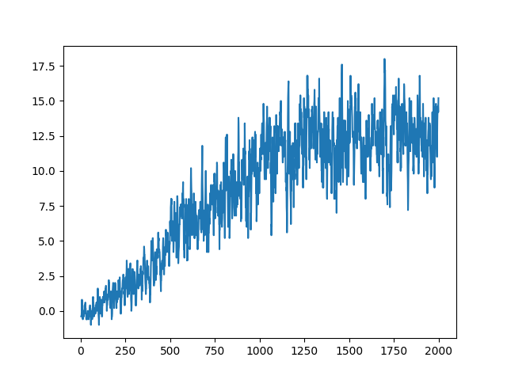

## Introduction

This project was an introduction to using 3D environments with OpenAI Gym to navigate a space autonomously using Deep Q-Learning.

### Learning Algorithm

I for my learning algorithm, I started with a basic Q-learning algorithm. I tried a few different hyperparameters. I tried a small buffer size, but that had a hard time converging. With a larger buffer size, the algorithm converged much more  consistently, so I set that size to be 3 * 1e5 in order to keep the past ~10000 episodes in the buffer (out of 20000 total episodes)

For the exploration rate, I tried a few things. I tried linear exploration rate through time (i/num_episodes) but that had a hard time getting high scores and was exploring too much and not exploiting enough. I tried logarithmic decay (.001^(i_num_episodes)) but that seemed to be not exploring enough, judging by the lack of learning. I decided to take advice from the original Deep RL paper and train linearly for the first half and then explore at a very small rate for the second half.

After all of this, the algorithm was going up but not as consistently or quickly as I might want it to. I decided to try out the Double Q-learning algorithm (decide on an action with the local network but then evaluate that action using the target network) and that helped stabilize learning a noticeable amount.

Here is a plot of the rewards over time:

